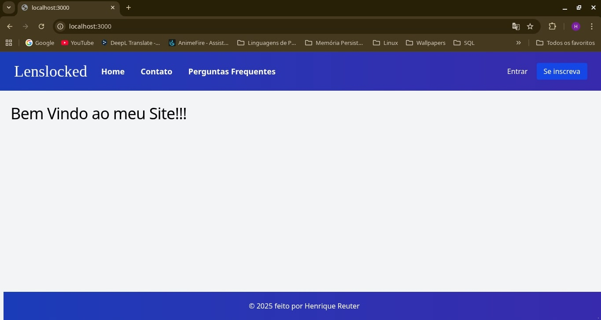
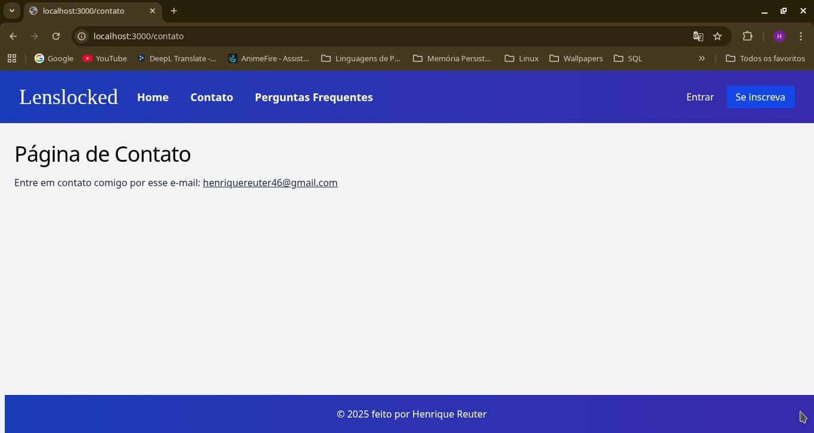
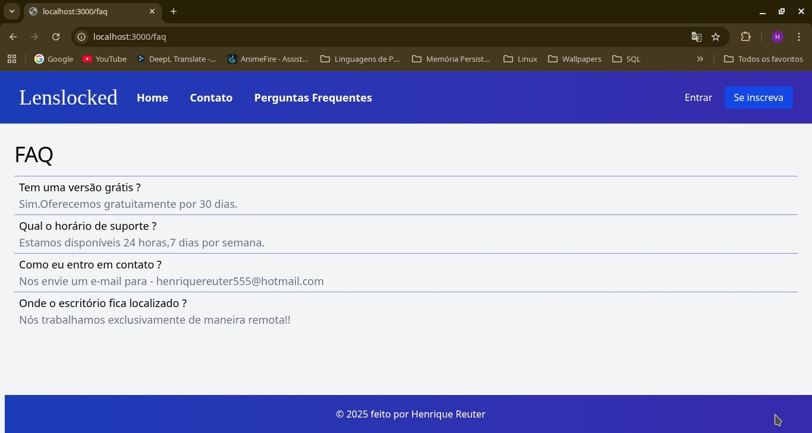
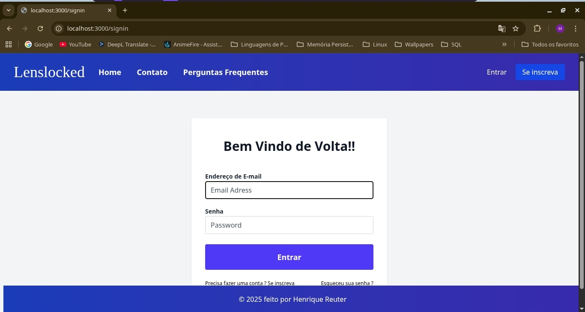
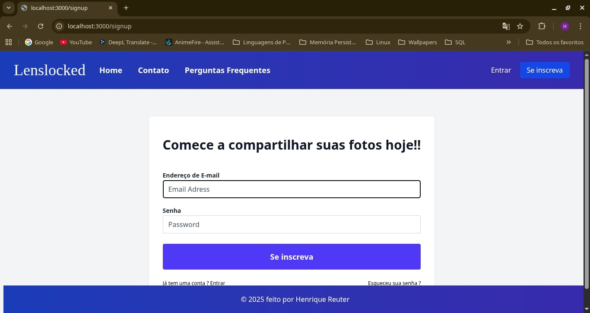
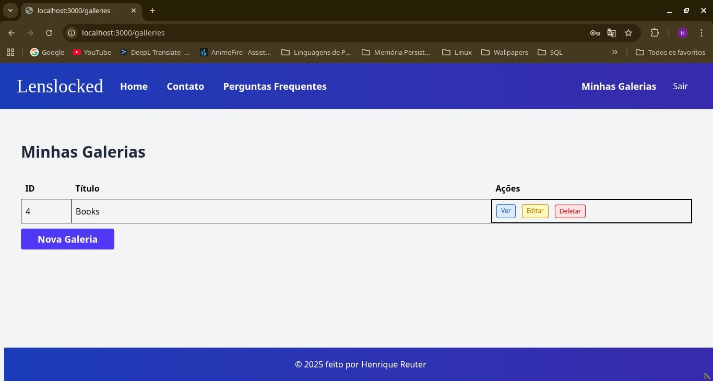
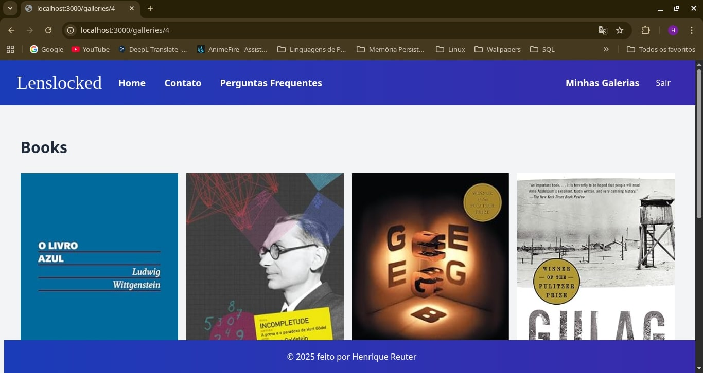
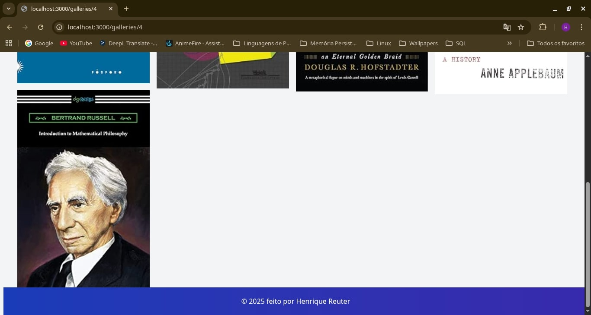

# Lenslocked 

## Description

Lenslocked is a photo sharing platform made with Go on the backend and with Tailwind as our front-end. It uses Gooses with Docker for automatic creation of our database tables. We use mailtrap for the password backup process.

### How to use it  
First create and fill a  .env file. Copy the .env.template to know what fields  need to be filled.

After that, run docker-compose that will setup, our db,tailwind and adminer(a simple front-end to see the data stored on our database):
    
    docker compose up 

Open another terminal, while docker runs, and run our server with:

    go run cmd/server/server.go

### Screenshots
Down below you can see some of the screens of the app when it runs. I created a simple user and a gallery with some pics for the example:

* Home Page 

        
* Contact page

* FAQ page

* Sign in page

* Sign up page

* Your Galleries page

* Screenshot 1 of the Books gallery

* Screenshot 2 of the Books gallery

## References 

* https://github.com/go-chi/chi

* https://github.com/cortesi/modd

* https://github.com/pressly/goose

* https://github.com/joho/godotenv

* https://caddyserver.com/

* https://mailtrap.io/
